<div align="center">

<picture>
  <source media="(prefers-color-scheme: dark)" srcset="assets/images/tuvima-logo-dark.svg">
  <source media="(prefers-color-scheme: light)" srcset="assets/images/tuvima-logo.svg">
  
</picture>

**One library. Every story.**

Your books, films, shows, music, audiobooks, comics, and photos—together in one private library.

Tuvima Library turns the media you already own into a collection that is easier to explore, understand, and enjoy.

[Get Started](https://tuvima.github.io/tuvima_library/tutorials/getting-started/) ·
[Read the Documentation](https://tuvima.github.io/tuvima_library/) ·
[See Product Status](https://tuvima.github.io/tuvima_library/product/status/)

<br/>

[](https://www.gnu.org/licenses/agpl-3.0)
[](https://dotnet.microsoft.com/)
[](https://tuvima.github.io/tuvima_library/product/status/)

</div>

---

## Your Collection Should Feel Like a Library

Personal media collections rarely live in one neat place. A single story might be an ebook in one folder, an audiobook in another, a film on a hard drive, and a soundtrack mixed into a music collection. Most media software can make each file type look good, but the connection between them is usually left for you to remember or recreate.

Tuvima Library starts with the story.

Choose the folders Tuvima Library should watch and it builds a rich, browsable library around them. It identifies each item, adds useful metadata and artwork, connects related works where it has trustworthy evidence, and remembers your progress. Instead of searching through folders and filenames, you can explore the ideas, people, series, and creative worlds represented by the media you own.

Not every file needs an online identity. Personal libraries can keep home videos, lectures, and unmatched custom content local-only, bypassing retail providers and Wikidata. Photos use a separate local asset index with a date timeline, favorites, hidden items, albums, duplicate detection, and EXIF details; originals remain in place.

See the [Beta Roadmap](https://tuvima.github.io/tuvima_library/product/beta-roadmap/) for the architectural priority order and the post-beta photo-intelligence boundary.

## See Tuvima Library

Home brings the whole library together, regardless of media type.

<a href="assets/screenshots/home.jpg">
  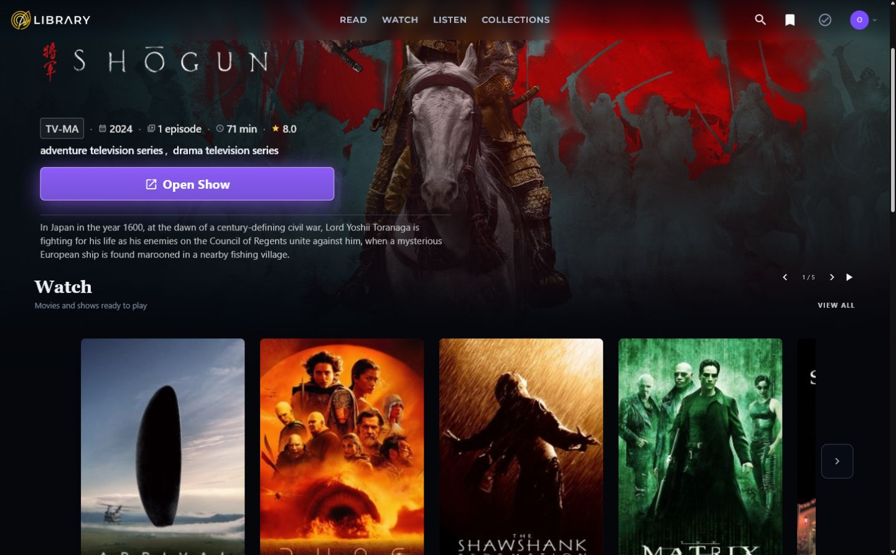
</a>

<sub>Home at a 1440-pixel-wide desktop viewport. Click any screenshot to view it at full size.</sub>

### Explore Every Lane

Read, Watch, and Listen give each kind of media an experience designed for it without splitting the collection into unrelated libraries.

<table>
  <tr>
    <th>Read</th>
    <th>Watch</th>
    <th>Listen</th>
  </tr>
  <tr>
    <td><a href="assets/screenshots/read.jpg">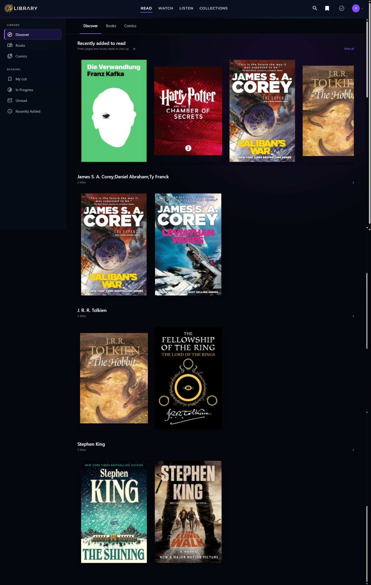</a></td>
    <td><a href="assets/screenshots/watch.jpg">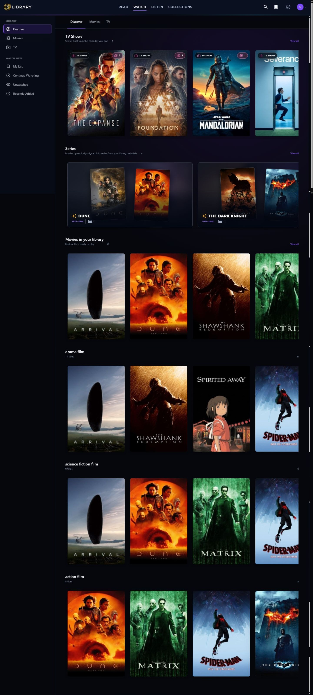</a></td>
    <td><a href="assets/screenshots/listen.jpg">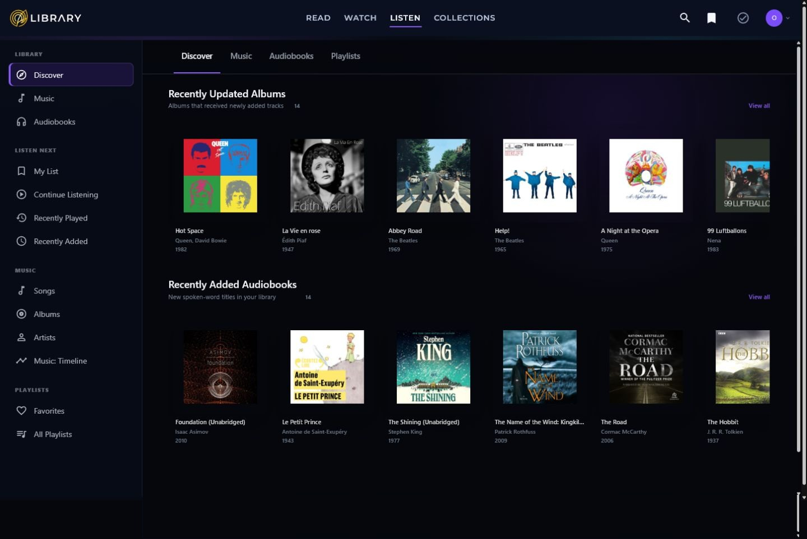</a></td>
  </tr>
</table>

### One Detail Experience Across Every Kind of Media

Every detail page shares a familiar structure while adapting to what matters for that medium: reading, watching, listening, sequence, tracks, episodes, credits, or connected works.

<table>
  <tr>
    <th>Book · The Hobbit</th>
    <th>Comic · The Sandman</th>
  </tr>
  <tr>
    <td><a href="assets/screenshots/book-the-hobbit.jpg">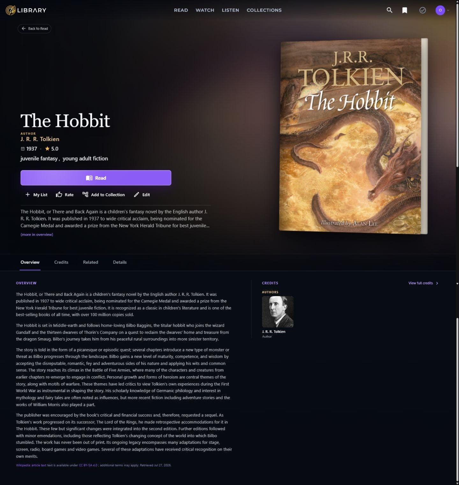</a></td>
    <td><a href="assets/screenshots/comic-sleep-of-the-just.jpg">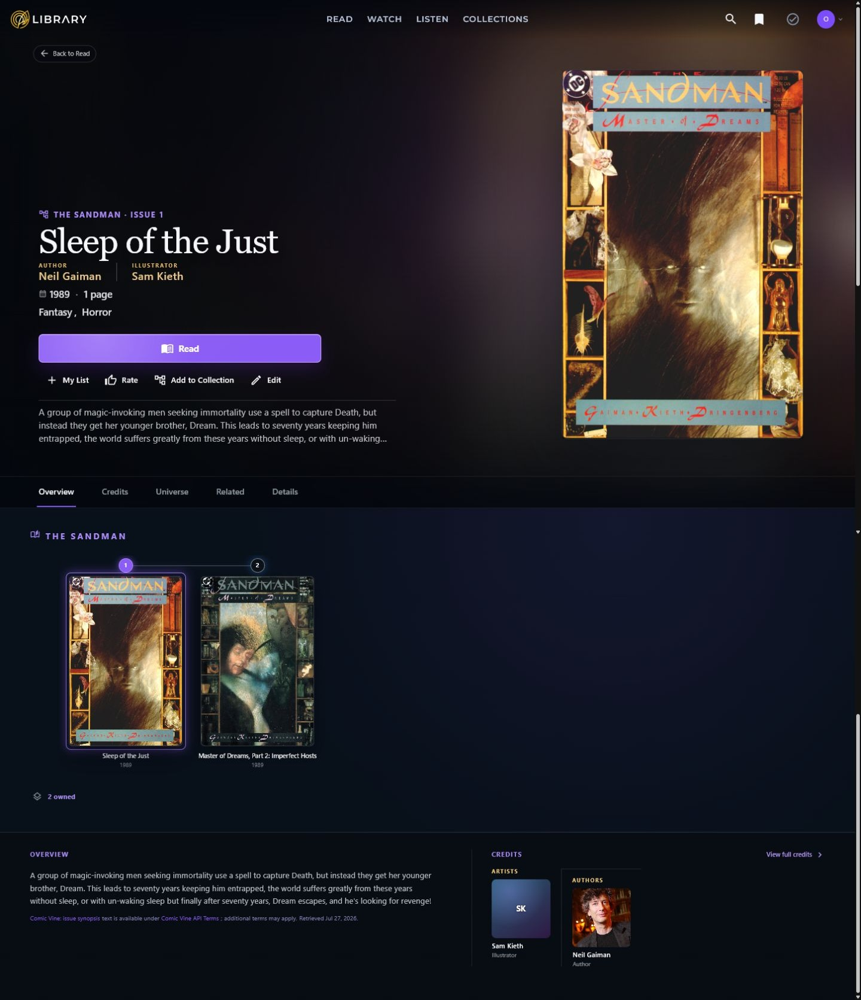</a></td>
  </tr>
  <tr>
    <th>Movie · Dune: Part Two</th>
    <th>TV Show · The Expanse</th>
  </tr>
  <tr>
    <td><a href="assets/screenshots/movie-dune-part-two.jpg">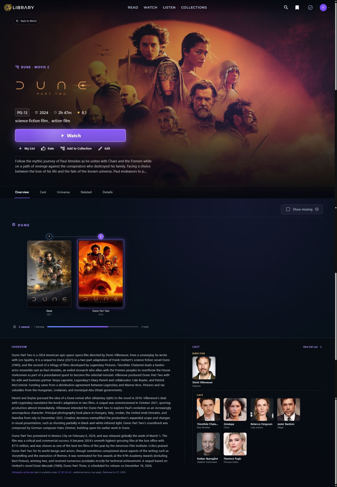</a></td>
    <td><a href="assets/screenshots/tv-show-the-expanse.jpg">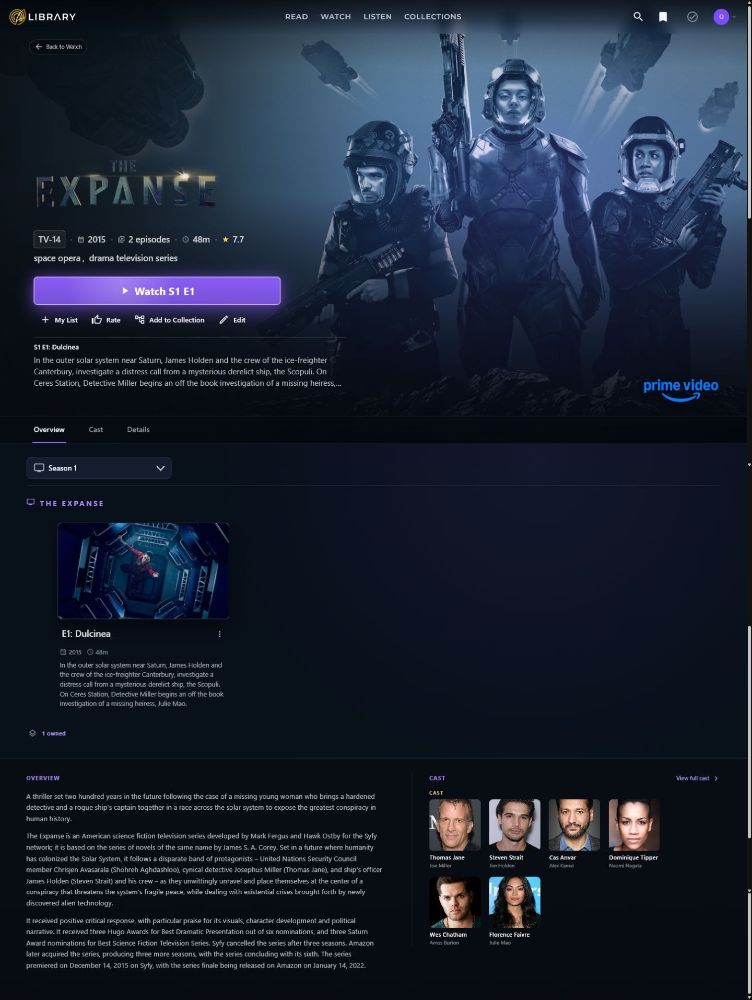</a></td>
  </tr>
  <tr>
    <th>Music Album · Abbey Road</th>
    <th>Audiobook · The Hobbit</th>
  </tr>
  <tr>
    <td><a href="assets/screenshots/music-album-abbey-road.jpg">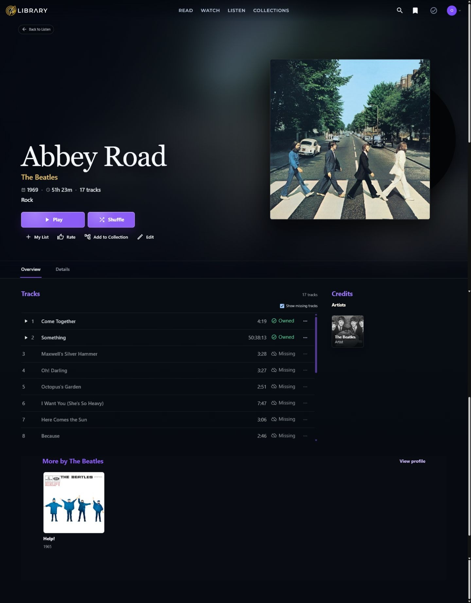</a></td>
    <td><a href="assets/screenshots/audiobook-the-hobbit.jpg">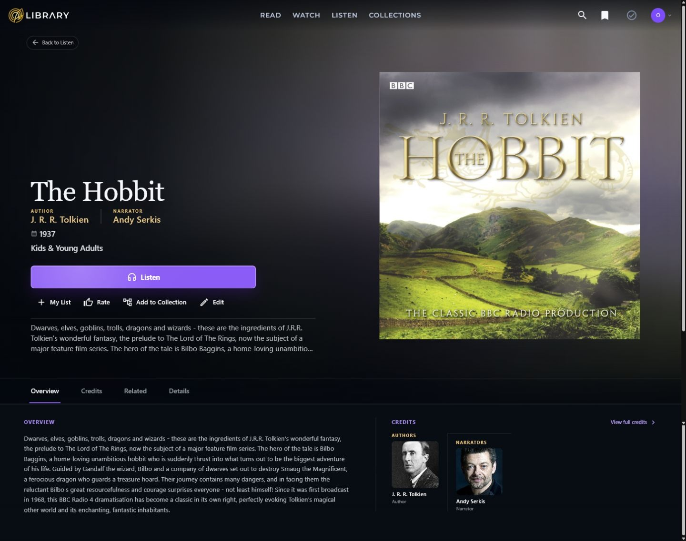</a></td>
  </tr>
  <tr>
    <th>Collection · Dune</th>
    <th>Person · J. R. R. Tolkien</th>
  </tr>
  <tr>
    <td><a href="assets/screenshots/collection-dune.jpg">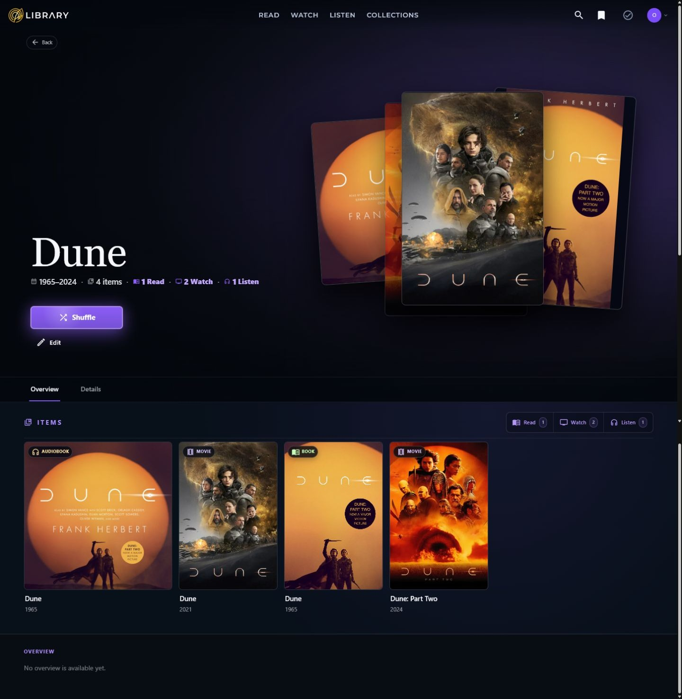</a></td>
    <td><a href="assets/screenshots/person-jrr-tolkien.jpg">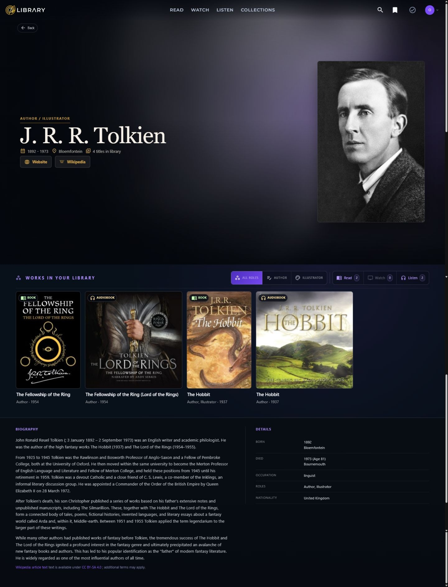</a></td>
  </tr>
</table>

## Why I Started Tuvima Library

Tuvima Library began with a gap I felt in my own library.

I was—and still am—an avid user of Plex, Audiobookshelf, and other media managers. I appreciated what each one did well, but I was still responsible for remembering how everything connected. The book lived in one library, its audiobook in another, the film adaptation somewhere else, and the soundtrack somewhere else again. The more formats I collected, the less the whole thing felt like one collection.

Books made the problem especially clear. I might read an ebook at home, then want to continue the same story as an audiobook while driving to work. Amazon's Kindle and Audible apps use [Whispersync for Voice](https://help.audible.com/s/article/listen-with-whispersync-for-voice?language=en_US) to make that switch feel natural—but only for supported Kindle and Audible editions. I wanted that kind of continuity for media I already owned and controlled.

Watching adaptations raised a different set of questions:

- Where did this scene happen in the book?
- Was it changed for the film?
- Who is this character, and what is their history?
- How are they connected to the other people, places, and events in this world?
- Which actor played the same character in another adaptation?

A normal remote can pause the movie or change the volume, but it cannot help explore the story. I imagined a phone becoming a true companion: following where I was in the film and offering timely, spoiler-aware context about a character, location, event, performer, or source chapter.

That was the realization behind Tuvima Library. The missing piece was not another player. It was a shared understanding of the works and the universe around them. As I looked beyond my own setup, I found many other collectors trying to bridge the same gaps with separate servers, manual collections, spreadsheets, plugins, and memory.

The name came from the same idea. [ElfDict lists **túvima**](https://www.elfdict.com/w/tuuvima/q) as a Quenya adjective meaning **“discoverable,”** citing Tolkien's linguistic material through its Eldamo entry. A product intended to reveal the stories and connections hidden across a media collection needed a name that meant exactly that. **Tuvima Library** was the logical choice.

Tuvima Library is the library I wanted for myself, built in the hope that it can become that library for others too.

## What Tuvima Library Means by a Universe

A **Universe** is not another folder or playlist. It is the living map of a creative world.

It connects:

- The works you own across books, comics, audiobooks, films, television, and music.
- Different editions and formats, ordered series, and broader Collections.
- Adaptations, sequels, prequels, spin-offs, and source material.
- Creators, performers, narrators, characters, locations, organizations, and events.
- The timelines and relationships that explain how everything fits together.

A Collection is the browsable view that brings related owned shelves together. The Universe is the knowledge behind it. A Middle-earth Collection might gather novels, audiobooks, films, and soundtracks; its Universe can explain who Frodo is, how he relates to Bilbo, where Rivendell fits into the story, and who portrayed each character.

Your files remain at the center. The Universe never pretends external knowledge is media you own, and it only presents relationships supported by real evidence.

### From Remote Control to Story Companion

The Universe model is intended to remain useful after you press Play or begin reading.

In the fuller vision, a phone could follow the current point in a film and show spoiler-aware context about the character on screen, their background so far, the performer, the location, and the matching passage in the source book. Instead of merely asking a phone to pause *The Lord of the Rings*, you could ask, “Who is this character?” or “Where did this happen in the book?” and receive an answer grounded in the right adaptation and moment.

The same foundation can support cross-format position mapping: stop reading an ebook at home, begin the audiobook in the car, and continue from the corresponding narrative point. It is a local-first version of the continuity that makes Whispersync for Voice compelling, designed for the editions you own.

Wikidata supplies canonical identities and relationships; Wikipedia supplies readable context; Tuvima Library's local analysis can align positions, chapters, scenes, and playback time. Today, the foundations include shared identities, progress, media relationships, people and character links, and sourced Universe Graph data. Automatic cross-format position matching, scene mapping, and the real-time companion are still in development.

Learn more in [How Universes and Series Work](https://tuvima.github.io/tuvima_library/explanation/how-universes-work/) and the technical [Universe Graph](https://tuvima.github.io/tuvima_library/architecture/universe-graph/) documentation.

## Collections That Build Themselves

Tuvima Library uses a simple principle: immediate groups should be useful, while broader Collections should earn their place.

- A book series becomes an ordered shelf in Read.
- A film series or TV show becomes a shelf in Watch.
- An album or audiobook series becomes a shelf in Listen.
- A broader Collection appears only when trusted metadata connects multiple shelves through a real series, franchise, or creative-world relationship.

For example, owning only a film trilogy creates a useful Watch shelf. Owning related novels, film series, audiobooks, and music can create a broader Collection that brings those shelves together. An ebook and audiobook of one title do not create a Collection by themselves; they are two owned ways to experience the same work.

These structural groupings are automated. Tuvima Library uses file metadata and configured knowledge sources to identify relationships, then updates the view as the library changes. It does not rely on similar titles alone, and uncertain matches are sent for review rather than silently forcing unrelated items together.

Richer personal rules, recommendations, and smart collection automation remain in development. Learn more in [How Universes and Series Work](https://tuvima.github.io/tuvima_library/explanation/how-universes-work/).

## Wikipedia and Wikidata Give the Library Context

[Wikipedia](https://en.wikipedia.org/wiki/Wikipedia:About) and [Wikidata](https://www.wikidata.org/wiki/Wikidata:Introduction) are two of the most remarkable resources behind Tuvima Library. Both are built and maintained by people around the world, and each brings something essential to the library.

Wikidata provides structured identity, facts, and relationships that software can understand. Wikipedia provides the human-readable history, descriptions, biographies, and context that help people understand why a work or creator matters.

A metadata provider can help Tuvima Library identify a file as a particular book, film, album, or episode. Wikidata helps place that item in the wider world, while Wikipedia helps explain it:

- Is this work part of a series, franchise, or adaptation?
- Which people created, performed, directed, narrated, or composed it?
- Which formats and owned shelves belong to the same creative world?
- What is the history and human context behind the work, person, or collection?

Tuvima Library first looks for a safe media match and a trustworthy identifier, such as an ISBN, TMDB ID, MusicBrainz ID, or Comic Vine ID. It can then find the corresponding Wikidata item, follow supported relationships, and retrieve linked Wikipedia context. If a reliable identity is unavailable, Tuvima Library does not use open knowledge as a guessing engine; the item remains usable with other metadata or waits for review.

### Giving Back to Wikipedia and Wikidata

Tuvima Library does not see Wikipedia and Wikidata as simply free services to consume. They are shared public infrastructure, built through an extraordinary amount of community effort, and the project wants to support them wherever possible.

That means:

- Clearly attributing and linking to original sources, while preserving provenance, retrieval time, licensing, and modifications.
- Querying and caching responsibly.
- Making data gaps and uncertain relationships visible instead of hiding them.
- Contributing corrections, citations, translations, modeling improvements, documentation, and open tooling where appropriate.

Readers can [contribute to Wikipedia](https://en.wikipedia.org/wiki/Wikipedia:Contributing_to_Wikipedia), [participate in Wikidata](https://www.wikidata.org/wiki/Wikidata:Contribute), or [support the Wikimedia movement](https://donate.wikimedia.org/). Helping this knowledge become more complete benefits Tuvima Library and everyone else building with open knowledge.

## What Tuvima Library Does Differently

The media-management ecosystem is broad, and many of its tools are excellent at the job they were designed to do.

| Kind of tool | Common choices | What they do especially well | Tuvima Library's different job |
|---|---|---|---|
| General media servers | [Plex](https://support.plex.tv/articles/200288286-what-is-plex/), [Jellyfin](https://jellyfin.org/), [Emby](https://emby.media/about.html) | Mature streaming, transcoding, live TV, and apps for movies, shows, music, and photos | Connect those experiences to books, comics, audiobooks, soundtracks, adaptations, and the wider creative world |
| Living-room media centers | [Kodi](https://kodi.tv/about/) | Flexible playback of local and network media, a television-first interface, and extensive customization | Build a persistent, server-side understanding of works, versions, people, shelves, and Collections across formats |
| Book and comic libraries | [calibre](https://calibre-ebook.com/about), [Kavita](https://www.kavitareader.com/), [Komga](https://komga.org/) | Ebook management and conversion, device workflows, comics and manga organization, and purpose-built readers | Place reading alongside audiobooks, screen adaptations, music, creators, and other owned media without losing the reading experience |
| Audio specialists | [Audiobookshelf](https://audiobookshelf.org/docs/documentation/introduction/), [Navidrome](https://www.navidrome.org/) | Focused audiobook, podcast, or music playback with strong audio-specific tools and compatible apps | Connect an audiobook or album to its source work, other formats, creators, series, and broader Collection |
| Acquisition and file automation | [Sonarr](https://sonarr.tv/), [Radarr](https://radarr.video/), [Lidarr](https://lidarr.audio/) | Monitor releases and automate acquisition, quality choices, renaming, and file organization for a particular media type | Begin with the files you own, determine what they are, enrich them, and reveal how they relate across every supported media type |
| Cross-media story library | **Tuvima Library** | A common, local-first view of the stories and creative worlds represented by the media you own | Make cross-media understanding the foundation, so the library can build and evolve its structure as it learns what each item is |

These tools do not always need to be replaced. Automation tools can prepare files that Tuvima Library then watches, while specialist players may remain valuable for particular devices or formats. Tuvima Library's goal is to provide the shared library those separate workflows do not.

Its advantage is not simply supporting more file extensions. It is understanding that the files are related—and using that understanding to make the whole collection more valuable than the sum of its folders.

## Built Around Ownership and Privacy

- **Local first:** the Engine, Dashboard, SQLite database, managed artwork, and optional AI models run locally.
- **No hosted account:** using Tuvima Library does not require an account or subscription.
- **No built-in tracking:** Tuvima Library does not include product telemetry.
- **Your choice of metadata sources:** external providers are contacted only when configured and needed.
- **Human review when it matters:** low-confidence matches are surfaced instead of silently treated as correct.
- **Free and open source:** there is no premium tier or feature gate.

Read more about [Privacy and Local-First Behavior](https://tuvima.github.io/tuvima_library/explanation/privacy-local-first/).

## What You Can Add

| Experience | Media | Common formats |
|---|---|---|
| Read | Books and comics | EPUB, PDF, CBZ, CBR |
| Watch | Movies and TV | MKV, MP4, M4V, WEBM, AVI |
| Listen | Music and audiobooks | FLAC, MP3, AAC, M4A, OGG, WAV, M4B |

See [Supported Media Types and Formats](https://tuvima.github.io/tuvima_library/reference/media-types/) for the complete, current list.

## Early Access

Tuvima Library is under active development. The core Engine and Dashboard are real and usable today, but some experiences are still being refined.

Current builds include:

- Folder scanning, file identification, metadata enrichment, artwork management, and duplicate handling.
- Home, Read, Watch, Listen, Collections, library-wide Search, and rich detail pages.
- EPUB reading plus audio and video playback with saved progress and personal preferences.
- Series, people, playlists, and collection views backed by library data.
- Inline corrections and a Review Queue for items that need help.
- Settings for libraries, providers, profiles, local AI, plugins, ingestion, and system health.

Features still in development include:

- A guided first-run experience.
- Richer recommendations, playlists, personal rules, and smart collections.
- Cross-format position matching between ebooks and audiobooks.
- Scene-to-source mapping and a spoiler-aware mobile story companion.
- More advanced playback, subtitles, delivery, and offline controls.
- Plugin marketplace installation and updates.
- Broader remote-access hardening and interoperability.
- Deeper integration of local AI across library workflows.

The [Product Status](https://tuvima.github.io/tuvima_library/product/status/) page explains what is live, partial, or planned. For a detailed implementation view, see the [Feature Truth Inventory](https://tuvima.github.io/tuvima_library/product/feature-truth-inventory/).

## Try Tuvima Library

Tuvima Library currently targets developers and early adopters running it from source.

You will need:

- [.NET 10 SDK](https://dotnet.microsoft.com/download)
- A local copy of this repository
- Optional provider credentials for services that require them
- About 10 GB of free space if you want to use local AI models

Clone and restore:

```bash
git clone https://github.com/Tuvima/tuvima_library.git
cd tuvima_library
dotnet restore MediaEngine.slnx
```

Start the Engine and Dashboard in separate terminals:

```bash
dotnet run --project src/MediaEngine.Api
```

```bash
dotnet run --project src/MediaEngine.Web
```

Then open `http://localhost:5016`, add your folders in **Settings > Libraries**, and start your first scan.

The [Getting Started guide](https://tuvima.github.io/tuvima_library/tutorials/getting-started/) covers configuration, provider credentials, Docker, and troubleshooting. Continue with [Your First Library](https://tuvima.github.io/tuvima_library/tutorials/first-library/) for the full first-scan walkthrough.

## Learn More

Full user and developer documentation lives at [tuvima.github.io/tuvima_library](https://tuvima.github.io/tuvima_library/).

| If you want to... | Read... |
|---|---|
| Install and launch Tuvima Library | [Getting Started](https://tuvima.github.io/tuvima_library/tutorials/getting-started/) |
| Build your first library | [Your First Library](https://tuvima.github.io/tuvima_library/tutorials/first-library/) |
| Add and organize media | [How to Add Media](https://tuvima.github.io/tuvima_library/guides/adding-media/) |
| Understand how Tuvima Library identifies files | [How File Ingestion Works](https://tuvima.github.io/tuvima_library/explanation/how-ingestion-works/) |
| Understand shelves, Collections, and Universes | [How Universes and Series Work](https://tuvima.github.io/tuvima_library/explanation/how-universes-work/) |
| Configure metadata services | [Configure Providers](https://tuvima.github.io/tuvima_library/guides/configuring-providers/) |
| Check what is ready today | [Product Status](https://tuvima.github.io/tuvima_library/product/status/) |
| Explore the architecture | [Technical Overview](https://tuvima.github.io/tuvima_library/architecture/technical-overview/) |
| Fix a problem | [Troubleshooting](https://tuvima.github.io/tuvima_library/guides/troubleshooting/) |

## Contributing

Bug reports, feature ideas, documentation improvements, and code contributions are welcome. Start with [CONTRIBUTING.md](CONTRIBUTING.md), [report a bug](https://github.com/Tuvima/tuvima_library/issues), or [request a feature](https://github.com/Tuvima/tuvima_library/issues).

The product is branded as **Tuvima Library**, while many projects and namespaces in the code still use the earlier `MediaEngine.*` name. They refer to the same product.

Tuvima Library is built on open-source software and public-knowledge projects. See [Attributions](https://tuvima.github.io/tuvima_library/reference/attributions/) for the maintained acknowledgement list.

## License

Tuvima Library is free and open-source software under the [GNU Affero General Public License v3.0](LICENSE).

That choice is part of the product promise. Your library should not depend on one maintainer, company, or organization continuing to exist. The source is available for anyone to run, study, improve, share, and preserve. If the original project ever stops, other people can carry it forward.

The AGPL also keeps improvements available to the community. Anyone distributing a modified version—or making one available to users over a network—must provide its corresponding source code under the same license. Open source cannot guarantee that a project will be maintained forever, but it means no single entity has to remain the gatekeeper for Tuvima Library to continue.

---

<div align="center">

**You already own the stories. Tuvima Library makes them easier to find, understand, and enjoy.**

[Documentation](https://tuvima.github.io/tuvima_library/) ·
[Report a Bug](https://github.com/Tuvima/tuvima_library/issues) ·
[Request a Feature](https://github.com/Tuvima/tuvima_library/issues)

</div>
