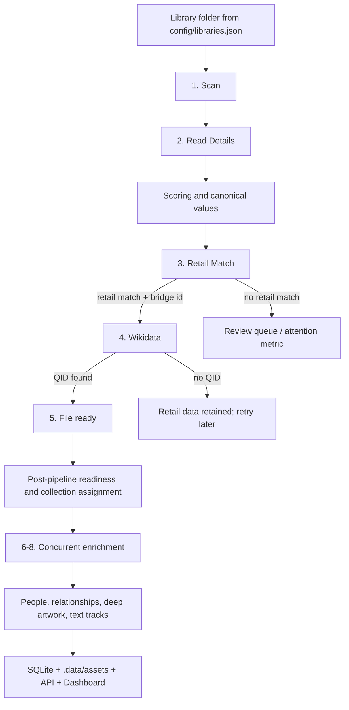

# Ingestion, Identity, Enrichment, And Universe Pipeline

This report is the canonical map for how Tuvima Library turns files on disk into browseable works, people, artwork, relationships, and universe details.

The current pipeline has one modern storage rule: managed artwork and person images live under `.data/assets/...` and are indexed through database records such as `entity_assets`, `persons.local_headshot_path`, `character_portraits`, and `text_tracks`. Adjacent media-file sidecars are optional exports only when storage policy enables them. Legacy `.data/images`, `_pending`, `_provisional`, and `.people` runtime fallbacks are not part of the live ingestion path.

## End-To-End Flow

## Dashboard Stage Model

The Ingestion page uses the numbered operational stages below. These are the product-facing progress rows rendered from `GET /ingestion/operations.stage_progress`.

| # | Stage | Notes |
| ---: | --- | --- |
| 1 | Scan | Discovers and accepts files in configured source folders. |
| 2 | Read Details | Parses embedded metadata and local file evidence. |
| 3 | Retail Match | Collapses retail/catalog lookup, quick metadata, and first cover/poster evidence into one bar. |
| 4 | Wikidata | Uses bridge IDs from Stage 3 to resolve canonical QIDs. |
| 5 | Ready | Makes the file visible or records a terminal outcome. |
| 6 | People | Links and enriches people once retail/Wikidata claims exist. |
| 7 | Relationships | Builds series, shelves, child items, and relationship graphs. |
| 8 | Artwork | Fetches later artwork such as backgrounds, banners, logos, disc art, season posters, album variants, and episode stills. |

Stages 6, 7, and 8 can run concurrently after their prerequisites are present. Grouped provider calls, including batched `Tuvima.Wikidata` work, show group labels when exact per-file labels are not available. Review/attention is a live exception metric and latest-batch delta, not a ninth progress row in the Dashboard.

Series order is user-facing only when it affects the local shelf. Tuvima prefers explicit order values such as local `series_pos`, retail series position, or Wikidata ordinal qualifiers. Wikidata previous/next chain warnings are kept as diagnostics because public Wikidata chains can be incomplete or one-directional; they do not create Review Queue rows by themselves.

## Sequence Placement Framework

Tuvima uses one shared ingestion pipeline, but sequence placement is resolved by
media-specific rules. The shared normalized fields are:

| Field | Meaning |
| --- | --- |
| `ordinal_sort` | Numeric sort position for children, including decimals, fractions, annuals, specials, discs, and tracks. |
| `sequence_total` | Expected item count for the accepted immediate container. |
| `sequence_total_scope` | Whether the total describes the main sequence, extras, standalone item, collected edition, or broader franchise. |
| `sequence_format` | Structural format such as standard item, annual, special, omnibus, compilation, or TV special. |

Immediate shelves and broader rollups are different products. `series_qid` is
only for an ordered, lane-compatible container. `franchise_qid` or universe
relationships may support discovery rollups, but they do not replace a comic
volume, album, TV season/show, book series, or film collection shelf. Wikimedia
list articles and production lists are diagnostics only.

Provider-owned totals are preferred over sparse Wikidata child manifests when
the provider owns the ordering container: Comic Vine volume issue counts, Apple
album track counts, TMDB season episode counts and movie collection data, and
Wikidata manifests for books/audiobooks when no stronger retail sequence source
exists. Title-specific runtime facts are prohibited; examples such as decimal
novella placement, comic annuals, and multi-disc tracks must work through the
normal ordinal parser and child identity rules.

## Stages 1-2: Local Ingestion

Inputs come from `config/libraries.json`. Each library entry declares `source_paths`, media type hints, read-only/writeback policy, and the source folders watched by the Engine. The ingestion options no longer use the old single `WatchDirectory` or `source_path` config shapes as runtime fallbacks.

The file watcher and polling safety net both feed the debounce queue. Polling is intentional, not legacy: it catches missed filesystem events and sweeps every configured source folder. The watcher buffers filesystem noise for the configured quiet period before creating a batch; unchanged same-path events are suppressed by file fingerprint, while changed or replaced files at the same path can be queued again. The pipeline skips engine-owned hidden state such as `.data`.

Stages 1 and 2 create or update:

| Artifact | Purpose |
| --- | --- |
| `media_assets` | One owned file on disk, with path, hash, status, and library attribution. |
| `editions` | Format/release layer that owns one or more media assets. |
| `works` | The underlying title/story/work identity. |
| `metadata_claims` | Append-only facts extracted from processors and providers. |
| `canonical_values` | Current best scalar value per field after scoring. |
| `canonical_value_arrays` | Current best multi-valued fields as ordered rows with optional QIDs. |
| `review_queue` | Human review for blocked, ambiguous, low-confidence, or invalid items. |
| `identity_jobs` / operation state | Durable handoff between retail, Wikidata, hydration, and universe work. |

Local processors read what the file itself can prove:

| Media type | Processor evidence | Typical Stage 2 result |
| --- | --- | --- |
| Books | EPUB/PDF metadata, title, author, language, embedded cover. | Book asset, edition, work, local claims, optional embedded cover stream. |
| Audiobooks | Tags, chapters, duration, narrator/artist fields, embedded cover. | Audiobook asset, duration claims, author/narrator candidates, review if ambiguous. |
| Movies | Container metadata, duration, stream info, title/year hints from path. | Movie asset with video facts and candidate title/year. |
| TV | Video metadata plus season/episode/path clues. | Episode asset linked toward show/season structure when confidence allows. |
| Music | Audio tags, album/artist/track/disc fields, duration, embedded art. | Track or album-level asset with music claims. |
| Comics | Archive metadata, filename/series/issue clues, cover candidate. | Comic issue or volume candidate. |
| Unknown | Generic file facts and filename tokens. | Unknown asset routed to review unless later evidence is strong. |

## Stage 3: Retail Metadata And Primary Artwork

Stage 3 searches configured retail or catalog providers. It is the strict gate before Wikidata: if Stage 3 cannot identify the item through a retail/catalog source or bridge ID, Stage 4 is not attempted. The item stays visible as local data or goes to review depending on confidence. Stage 3 also includes quick metadata and first cover/poster evidence because those signals are returned with retail/catalog matches.

Provider roles:

| Provider | Stage | Media types | Primary contribution |
| --- | --- | --- | --- |
| Apple | Stage 3 | Books, audiobooks, music where configured | Retail title, creator, cover, descriptions, ISBN/ASIN/store IDs. |
| TMDB | Stage 3 | Movies, TV | TMDB/IMDB/TVDB bridge IDs, posters, backdrops, cast/crew seeds, episode still seeds. |
| Comic Vine | Stage 3 | Comics | Series, issue, volume, cover, publisher, issue metadata. |
| Open Library | Disabled by default | Books | Not part of the current normal Stage 3 matrix unless explicitly enabled. |
| MusicBrainz | Disabled by default | Music | Not part of the current normal Stage 3 matrix unless explicitly enabled. |
| Fanart.tv | Stage 8 only | Movies, TV, music | Rich artwork after identity is known. It is not the Stage 3 identity gate. |
| LRCLIB | Text-track enrichment | Music | Lyrics/timed lyrics where configured. |
| OpenSubtitles | Text-track enrichment | Movies, TV | Subtitle candidates and local normalized text tracks. |

Stage 3 writes provider claims, candidates, retail status, cover candidates, bridge identifiers, and durable job state. Retail cover files are stored as managed assets through `AssetPathService` and `entity_assets` when persisted centrally. Identity workers are still timer-backed for resilience, but they also wake immediately when retail, bridge, or hydration work is signalled. Retry behavior is controlled by `config/hydration.json` with defaults of 5 attempts, 10-second exponential base delay, 300-second maximum delay, and 250-1750 ms jitter.

Canonical storage is split by shape. Scalar winners stay in `canonical_values`; multi-valued keys such as authors, genres, cast members, characters, and narrative locations live only in `canonical_value_arrays`. Readers join or format arrays for display, but storage no longer packs lists into delimited strings.

Provider secrets are config-file overlays. Base provider definitions live under `config/providers/*.json`; long-lived credentials live under `config/secrets/{provider}.json`.

## Stage 4: Wikidata Lookup

Stage 4 uses bridge IDs from Stage 3, not bare local filename QIDs. The old Tuvima `(Q12345)` path hint is intentionally ignored so filesystem naming cannot bypass retail gating. Supported bridge IDs include ISBN, ASIN, TMDB, IMDB, TVDB, and other provider-specific identifiers in `BridgeIdKeys`.

Stage 4 resolves the canonical Wikidata QID and validates it for the requested media type. If a provider bridge points to an entity of the wrong type, the result is rejected and the item remains reviewable or retryable. If no QID is found, Tuvima keeps the Stage 3 retail data and schedules periodic re-checking instead of discarding useful metadata.

Stage 4 creates:

| Artifact | Purpose |
| --- | --- |
| `wikidata_qid` canonical value | The canonical Wikidata entity for the work/edition context. |
| Bridge candidates | Candidate IDs, source provider, score, and match diagnostics. |
| QID labels | Local cache for QID-to-label display and offline relationship resolution. |
| Timeline events | Stage 4 matched/failed status for diagnostics and Dashboard progress. |

## Stage 5: File Ready

Stage 5 runs after Stage 3 for retained retail-only items or after Stage 4 for QID-backed items. Its job is to make the item useful quickly, not to finish every deep relationship. It fills core canonical metadata, refreshes obvious people, assigns shelves/collections, writes readiness state, and leaves deep universe enrichment for Stages 6-8.

Quick Hydration updates:

| Area | Details |
| --- | --- |
| Work/edition metadata | Canonical title, description, release year/date, language, rating/classification where available. |
| People | QID-backed authors, narrators, directors, cast, creators, composers, publishers, and aliases. |
| Collections | Series/show/album/shelf placement according to media type and relationship evidence. |
| Artwork | Preferred cover if available; managed central storage plus renditions through `entity_assets`. |
| Readiness | Whether the item is ready for library browsing, needs review, lacks universe data, or needs retry. |

People enrichment links QID-backed people to the owned media asset before fetching optional profile detail such as biography and headshots. Profile-detail failures are logged as partial enrichment and must not abort quick hydration, because the link evidence is already useful and can be refreshed by later enrichment work.

## Stages 6-8: People, Relationships, And Deep Artwork

Stages 6, 7, and 8 run after the item is visible and can run concurrently once their required claims, bridge IDs, or QIDs exist. They enrich the broader graph: people and cast, universe roots, series/franchise relationships, fictional entities, text tracks, and rich artwork.

Stage 6-8 providers and services include:

| Service/provider | Output |
| --- | --- |
| Wikidata graph/property expansion | Narrative roots, series/franchise/universe QIDs, fictional entity references, relationship edges. |
| Recursive identity enrichment | QID-backed people records and person-media links. |
| Metadata harvesting | Person biography, birth/death/nationality/occupation, pseudonym and group relationships, headshots. |
| Fanart.tv | Stage 8 backgrounds, logos, banners, clear-art, disc art, square art, season posters/thumbs, episode stills. |
| TMDB tagged images | Episode stills, cast/character portrait seeds when available. |
| LRCLIB/OpenSubtitles | Lyrics, subtitles, normalized text-track files, optional preferred exports. |

Stage 6-8 data artifacts:

| Artifact | Stored in | Meaning |
| --- | --- | --- |
| Entity assets | `entity_assets`, `.data/assets/artwork/...` | Cover, background, banner, logo, square, disc, clear-art, season, episode, and headshot variants. |
| Renditions | `entity_assets.local_image_path_s/m/l` | Generated small/medium/large files for fast UI loading. |
| People | `persons`, `person_media_links`, `person_aliases` | Real people, groups, pseudonyms, roles, and links to owned media. |
| Headshots | `persons.local_headshot_path`, `.data/assets/people/{personId}/headshot.*` | Canonical local person image path. |
| Fictional entities | `fictional_entities`, `character_portraits` | Characters, locations, organizations, portraits, actor-character images. |
| Relationships | `entity_relationships`, `collection_relationships`, `series_members` | Universe, series, franchise, member-of, has-part, pseudonym, cast/role, and narrative links. |
| Supplemental plugin lore | `plugin_lore_sources`, `plugin_lore_entities`, `plugin_lore_relationships` | Admin-approved plugin data that supplements Wikidata without becoming canonical. |
| Narrative roots | `narrative_roots` | Universe/franchise/series umbrellas used for graph grouping. |
| Text tracks | `text_tracks`, `.data/assets/text-tracks/...` | Lyrics/subtitles and normalized track metadata. |
| Timeline/activity | `entity_timeline`, `system_activity` | Operational history visible in diagnostics and Dashboard progress. |

## Source Attribution

Text derived from Wikipedia, Wikidata, or retail/provider descriptions carries
source attribution through the API. Detail surfaces should expose provider name,
source title, source URL, license name, license URL, retrieval timestamp, and
whether the text was modified or summarized for display. This keeps sourced
metadata inspectable and supports Wikimedia attribution requirements when
Wikipedia/Wikidata-derived text is shown.

## Media-Type Matrix

| Media type | Stage 3 retail gate | Stage 4 bridge | Stage 5 readiness | Stages 6-8 enrichment |
| --- | --- | --- | --- | --- |
| Books | Apple Books or configured book retail; Open Library disabled unless enabled. | ISBN/ASIN/store IDs to Wikidata work/edition QID. | Title, author, description, cover, shelf/series. | Authors, pseudonyms, fictional universe, series/franchise links, characters/locations when available. |
| Audiobooks | Apple or audiobook retail evidence plus local audio tags. | ISBN/ASIN/store IDs to work or audiobook edition QID, pivoted to canonical work when needed. | Title, author, narrator, duration, cover, audiobook shelf. | Narrator/person detail, pseudonyms, source-work/universe links, lyrics/transcript-adjacent data when configured. |
| Movies | TMDB identity. | TMDB/IMDB IDs to film QID. | Title, year, description, poster/backdrop, collection. | Cast/crew, characters, franchise/universe roots, Fanart.tv rich artwork, subtitles. |
| TV | TMDB show/season/episode identity. | TMDB/IMDB/TVDB IDs to show/episode QIDs. | Show/season/episode metadata, poster/still, TV shelf. | Cast/crew, episode stills, season art, show universe/franchise graph, subtitles. |
| Music | Apple/music retail when enabled; MusicBrainz disabled unless enabled. | Album/recording bridge IDs where available. | Artist, album, track, cover, music shelf. | Artist/person detail, album artwork variants, Fanart.tv music art, LRCLIB lyrics. |
| Comics | Comic Vine. | Comic/volume/issue bridge IDs where available. | Series, issue, publisher, cover, comic shelf. | Creators, characters, teams, locations, universe/franchise links, additional artwork. |
| Unknown | None until review or manual correction. | Not attempted. | Local facts only, review routing. | Not attempted until media type and identity are resolved. |

## Artwork Policy

`.data/assets` is canonical for managed assets:

| Asset class | Canonical path/record |
| --- | --- |
| Work artwork | `entity_assets` plus `.data/assets/artwork/{entityType}/{entityId}/{assetType}/{variantId}.*` |
| Person headshots | `persons.local_headshot_path` plus `.data/assets/people/{personId}/headshot.*` |
| Character portraits | `character_portraits.local_image_path` plus `.data/assets/artwork/...` where applicable |
| Text tracks | `text_tracks.local_path` plus `.data/assets/text-tracks/...` |

Deletion and maintenance use database-referenced paths, not guessed QID folders. The maintenance endpoint is `/maintenance/sweep-orphan-assets`, which scans `.data/assets` and removes managed files that are no longer referenced by the database. The old `/maintenance/sweep-orphan-images` endpoint is retired.

Optional sidecar exports, such as colocated artwork or metadata files next to media, are mirrors. They are not the Engine's canonical store and should not be used as runtime fallback reads.

API and UI surfaces should receive managed artwork URLs or settled placeholders,
not stale provider URLs. A provider URL may be retained as source provenance, but
cards, lane pages, album pages, detail pages, search results, review cards, and
collection pages should render through the managed asset stream once artwork has
been accepted.

## Readiness And Review States

The Review Queue is the safety net. Items enter review when media type is ambiguous, identity confidence is low, provider results conflict, required bridge IDs are missing, language policy blocks the item, or a manual decision is needed. Review uses the shared media editor; normal corrections belong inline on media surfaces.

Readiness states are built from:

| Signal | Meaning |
| --- | --- |
| Local extraction complete | The file was hashed, processed, and has local claims. |
| Retail matched | Stage 3 found provider evidence and bridge IDs. |
| Wikidata matched | Stage 4 resolved and validated a QID. |
| File ready | Stage 5 core visible metadata, cover/person basics, and collection assignment are done. |
| Universe pending | Item is usable but waiting for Stage 6-8 graph/art/text enrichment. |
| Ready | Required identity, metadata, artwork policy, and hierarchy signals are good enough for normal browsing. |
| Needs review | Human confirmation is required before the item should be trusted. |

The Ingestion page reports two Wikidata counts with different meanings: media-item QID progress counts media assets that resolved to a canonical identity, while the "Linking Wikidata QIDs" activity metric counts distinct resolved entity QIDs across works, people, collections, fictional entities, and manifest items. The Needs Review badge and review page both use the same ready-pending review query, so their counts should match.

## Implementation Plan

1. Watch folders are loaded from `config/libraries.json`; no normal runtime fallback reads a legacy single watch folder.
2. Stages 1 and 2 scan folders, read file-local metadata, and write claims/canonical values.
3. Stage 3 retail providers identify the item, provide bridge IDs, and provide primary cover/poster evidence. No retail match means no Wikidata attempt.
4. Stage 4 resolves Wikidata through bridge IDs and validates media type.
5. Stage 5 makes the item visible and assigns shelves/collections.
6. Stages 6, 7, and 8 expand people, artwork, fictional entities, relationships, universes, lyrics, and subtitles, and may run concurrently.
7. Managed files are stored through `AssetPathService` and database rows. Cleanup reads database paths and `.data/assets`, never `.data/images`.
8. Bad current-library rows are not repaired in place as part of ingestion fixes. Validate ingestion changes by running the development wipe/reingest harness against clean generated state, then inspect the rebuilt database and Dashboard counts.
9. Unsupported legacy storage paths and bad historical ingestion rows are not runtime fallback reads. Reset generated state and reingest instead of supporting dual paths.
